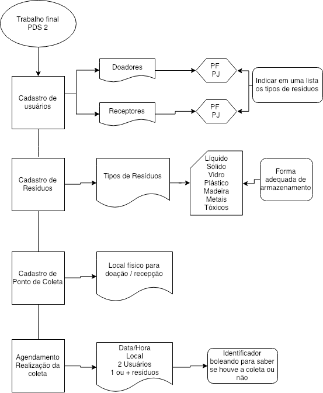

# Trabalho-PDS2
Repositório do trabalho da disciplina de Programação e Desenvolvimento de Software 2, UFMG 2018/2

## Grupo

Arthur Gomes Faria 2017001800
Victor Lucas Lima Vidigal 2018430356

## Introdução
Desdes os primórdios da civilização, a humanindade já descartava objetos que não lhes eram mais úteis. Os nômades já descartavam os restos dos animais que caçavam e, à medida em que o homem foi ficando mais “civilizado”, a quantidade de lixo produzida por ele também aumentou. Devido a esse acúmulo, a necessidade de reaproveitar e reduzir o impacto do excesso dos detritos surgiu e, com ela, alternativas importantes foram tomadas para contribuir com a diminuição de lixo, como por exemplo: a reciclagem.

A reciclagem faz parte dos três “R’s”: Reciclagem, Reutilização  e Redução. E é, de forma bem simples, a transformação de produtos usados em materiais novos, de grande potencial, e prontos para o consumo. Sua importância vai desde a contenção dos impactos nocivos ao meio ambiente até a geração de riquezas, pois objetos como o vidro, o alumínio, o plástico e o papel são reciclados e utilizados por indústrias como forma de reduzir os custos na produção. Além disso, os benefícios são enormes e chegam a todas as parcelas da população, devido a quantidade de empregos que ela tem gerado nas grandes cidades, muitos desempregados estão buscando trabalho no setor e conseguindo renda para manter suas famílias. Dessa forma, a reciclagem, apresenta-se como uma solução viável economicamente, além de ser ambientalmente correta.

Pensando em facilitar a interação entre os indivíduos comuns da sociedade e os indivíduos que perpetuam a ação da reciclagem, foi pensado um pequeno sistema que busca unir as duas entidades.

## Implementação

http://www.cs.colby.edu/maxwell/courses/tutorials/maketutor/
https://github.com/onqtam/doctest
https://github.com/tutaarthur/PDS2
http://www.cplusplus.com/reference/vector/vector/
https://www.tutorialspoint.com/cplusplus/cpp_exceptions_handling.htm
https://www.draw.io/
https://www.gnu.org/software/make/manual/html_node/Simple-Makefile.html
